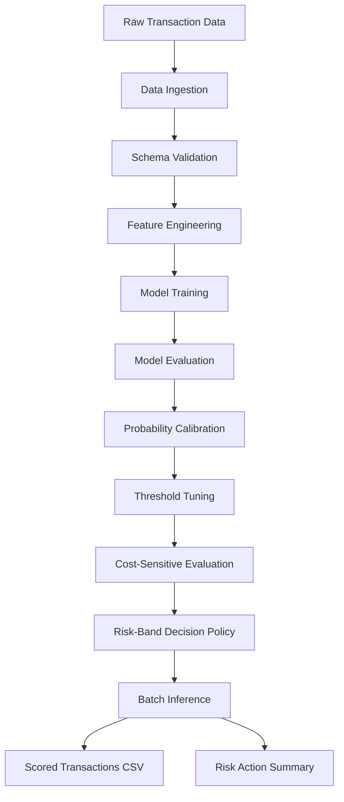
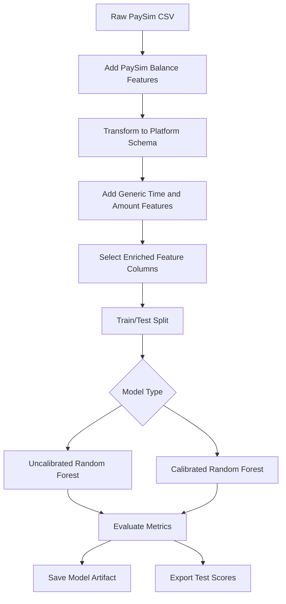
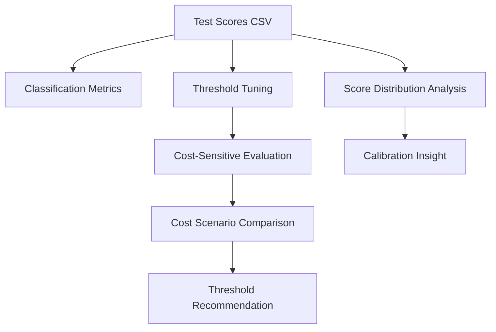
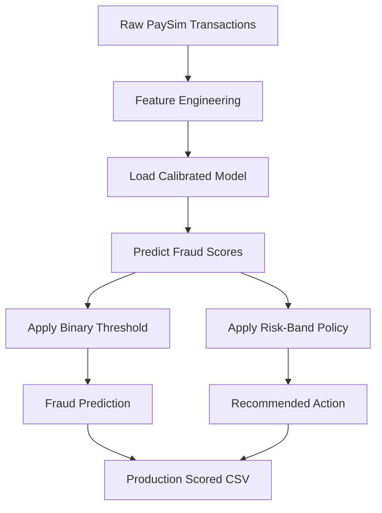
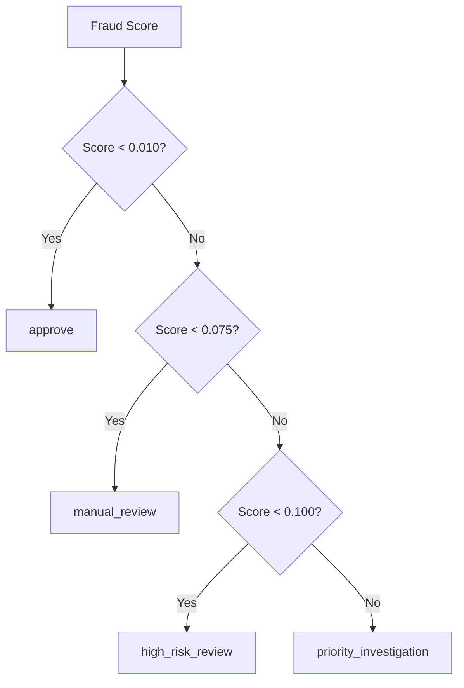

# Fraud Detection Platform Architecture Overview

## 1. Purpose

This document explains the architecture of the fraud detection platform.

The project is designed to demonstrate an end-to-end machine learning system for fraud detection, including:

```text
data ingestion
feature engineering
model training
evaluation
probability calibration
threshold tuning
cost-sensitive decisioning
batch inference
production-style scoring
risk action reporting
```

The goal is to show how a fraud model can move from experimentation to operational decision support.

---

## 2. System Overview

The platform follows a modular ML system design.

```text
Raw transaction data
        ↓
Data validation and ingestion
        ↓
Feature engineering
        ↓
Model training
        ↓
Evaluation and calibration
        ↓
Threshold and cost analysis
        ↓
Risk decision policy
        ↓
Batch scoring
        ↓
Analyst-facing outputs
```

The system is intentionally organized as a Python package rather than a notebook-only workflow. This makes the project easier to test, extend, and operate.

---

## 3. High-Level Architecture



---

## 4. Main Package Structure

```text
src/fraud_detection_platform/
├── cli/
├── data/
├── evaluation/
├── features/
├── models/
├── pipelines/
└── risk/
```

Each package has a specific responsibility.

---

## 5. Component Responsibilities

### data

The `data` package handles dataset loading, schema definitions, validation, and PaySim-specific data adaptation.

Key responsibilities:

```text
load transaction data
validate required columns
define platform schema
transform raw PaySim data into platform format
support labeled and inference-style data
```

Important files:

```text
data/schema.py
data/loader.py
data/paysim.py
data/sample_generator.py
```

---

### features

The `features` package creates model-ready features.

It includes both generic transaction features and PaySim-specific financial behavior features.

Generic features:

```text
transaction_hour
transaction_day_of_week
transaction_amount_log
```

PaySim-specific features:

```text
origin_balance_delta
destination_balance_delta
amount_to_origin_balance_ratio
amount_to_destination_balance_ratio
```

Important files:

```text
features/transformers.py
features/paysim_features.py
```

---

### models

The `models` package builds and trains fraud detection models.

Current model types:

```text
generic baseline Random Forest
PaySim-enriched Random Forest
calibrated PaySim-enriched Random Forest
```

Important files:

```text
models/baseline.py
models/paysim_baseline.py
models/calibrated_paysim.py
models/persistence.py
```

---

### evaluation

The `evaluation` package contains model and business evaluation utilities.

It supports:

```text
classification metrics
threshold evaluation
score distribution analysis
cost-sensitive threshold evaluation
cost scenario comparison
risk action summaries
```

Important files:

```text
evaluation/metrics.py
evaluation/thresholds.py
evaluation/score_distribution.py
evaluation/costs.py
evaluation/cost_scenarios.py
evaluation/action_summary.py
```

---

### risk

The `risk` package converts model scores into business actions.

Current policies:

```text
generic decision policy
calibrated risk-band decision policy
```

The calibrated policy supports:

```text
approve
manual_review
high_risk_review
priority_investigation
```

Important files:

```text
risk/decision_policy.py
risk/calibrated_decision_policy.py
```

---

### pipelines

The `pipelines` package coordinates full workflows.

Current workflows:

```text
generic training pipeline
batch inference pipeline
PaySim-enriched training pipeline
PaySim calibrated batch inference pipeline
```

Important files:

```text
pipelines/training.py
pipelines/batch_inference.py
pipelines/paysim_training.py
pipelines/paysim_batch_inference.py
```

---

### cli

The `cli` package exposes workflows through terminal commands.

It supports:

```text
sample data generation
PaySim data preparation
model training
threshold evaluation
score distribution analysis
cost evaluation
cost scenario comparison
batch inference
risk action summary generation
```

Important files:

```text
cli/generate_sample_data.py
cli/prepare_paysim_data.py
cli/train.py
cli/train_paysim_enriched.py
cli/evaluate_thresholds.py
cli/analyze_score_distribution.py
cli/evaluate_threshold_costs.py
cli/evaluate_cost_scenarios.py
cli/paysim_batch_inference.py
cli/summarize_actions.py
```

---

## 6. Training Flow

The PaySim-enriched training flow starts from raw PaySim data and trains either an uncalibrated or calibrated model.



Training command example:

```bash
python -m fraud_detection_platform.cli.train_paysim_enriched \
  --raw-paysim-data-path data/external/PS_20174392719_1491204439457_log.csv \
  --model-type calibrated \
  --model-output-path models/paysim_calibrated_fraud_model.joblib \
  --scores-output-path reports/paysim_calibrated_test_scores.csv
```

---

## 7. Evaluation Flow

The evaluation flow analyzes model scores from multiple angles.



Evaluation answers questions such as:

```text
How well does the model rank fraud?
Which thresholds are operationally useful?
Are scores well calibrated?
What threshold minimizes estimated business cost?
Does the best threshold change under different cost assumptions?
```

---

## 8. Production Scoring Flow

Production scoring uses a saved calibrated model to score transactions and assign risk actions.



Production scoring command:

```bash
python -m fraud_detection_platform.cli.paysim_batch_inference \
  --raw-paysim-data-path data/external/PS_20174392719_1491204439457_log.csv \
  --model-path models/paysim_calibrated_fraud_model.joblib \
  --output-path reports/paysim_calibrated_scored_transactions_production.csv \
  --threshold 0.010 \
  --review-threshold 0.010 \
  --high-risk-threshold 0.075 \
  --priority-threshold 0.100 \
  --production-mode
```

Production output columns:

```text
transaction_id
customer_id
transaction_time
transaction_amount
merchant_category
payment_channel
fraud_score
fraud_prediction
recommended_action
```

The production output intentionally omits `is_fraud` because true labels are not available at scoring time.

---

## 9. Risk Decisioning Flow

The calibrated risk-band policy converts fraud scores into operational actions.



Default policy:

```text
fraud_score < 0.010:
    approve

0.010 ≤ fraud_score < 0.075:
    manual_review

0.075 ≤ fraud_score < 0.100:
    high_risk_review

fraud_score ≥ 0.100:
    priority_investigation
```

---

## 10. Analyst and Manager Outputs

The platform produces two important business-facing outputs.

### Transaction-Level Scored File

This file supports case-level investigation.

Example columns:

```text
transaction_id
customer_id
transaction_time
transaction_amount
merchant_category
payment_channel
fraud_score
fraud_prediction
recommended_action
```

This tells analysts which transactions need review and why they were prioritized.

---

### Action Summary Report

This file supports management-level monitoring.

Summary fields:

```text
recommended_action
transaction_count
percentage_of_total
fraud_count
non_fraud_count
fraud_rate
average_fraud_score
average_transaction_amount
```

This helps answer:

```text
How many transactions were approved?
How large is the manual review queue?
How concentrated is fraud in each action band?
How many transactions require priority investigation?
```

---

## 11. Key Results

Important project milestones:

```text
PaySim-enriched features reduced false positives by about 75%.
Calibrated model achieved ROC-AUC of 0.9642 and PR-AUC of 0.2093.
Cost-sensitive evaluation selected threshold 0.010 under balanced assumptions.
Cost scenario comparison showed that threshold choice changes by business priority.
Production scoring mode produces analyst-facing outputs without ground-truth labels.
```

Risk action summary:

```text
approve:                   6,248,594 transactions
manual_review:               110,088 transactions
high_risk_review:              2,252 transactions
priority_investigation:        1,686 transactions
```

Fraud concentration by risk band:

```text
approve:                  0.0545%
manual_review:            2.77%
high_risk_review:         21.71%
priority_investigation:   75.44%
```

This shows that the risk-band policy concentrates fraud into smaller, higher-priority queues.

---

## 12. Design Principles

The platform follows several design principles.

### Keep generic and dataset-specific logic separate

Generic transaction logic is separated from PaySim-specific logic.

This avoids coupling the whole platform to one dataset.

---

### Test components before wiring pipelines

Feature engineering, models, evaluation utilities, and policies are tested independently before being used in workflows.

---

### Separate model scoring from business decisioning

The model produces fraud scores.

The risk policy converts scores into actions.

This keeps technical prediction logic separate from business policy logic.

---

### Support both evaluation and production modes

Evaluation mode may include labels such as `is_fraud`.

Production mode omits labels because true outcomes are not known at scoring time.

---

### Make business assumptions explicit

Cost assumptions are configurable and documented.

This avoids pretending that one threshold is universally optimal.

---

## 13. Current Limitations

Current limitations include:

```text
PaySim is simulated data
random train/test split is still used
no time-based validation yet
no real-time API endpoint yet
no dashboard yet
no drift monitoring yet
no model explainability yet
no analyst feedback loop yet
no deployment infrastructure yet
```

---

## 14. Recommended Next Improvements

Recommended next improvements:

```text
Add time-based validation
Add feature importance and explainability
Add a FastAPI real-time scoring endpoint
Add monitoring for score and action distribution drift
Add a lightweight dashboard for action summaries
Add analyst feedback loop simulation
Compare Random Forest with gradient boosting models
Add transaction-amount-based loss modeling
```

---

## 15. Summary

The fraud detection platform now demonstrates an end-to-end ML engineering workflow.

It moves from raw transaction data to calibrated fraud scores, risk-band actions, production-style CSV outputs, and business-facing summaries.

The architecture demonstrates both technical ML engineering and practical fraud operations thinking.
